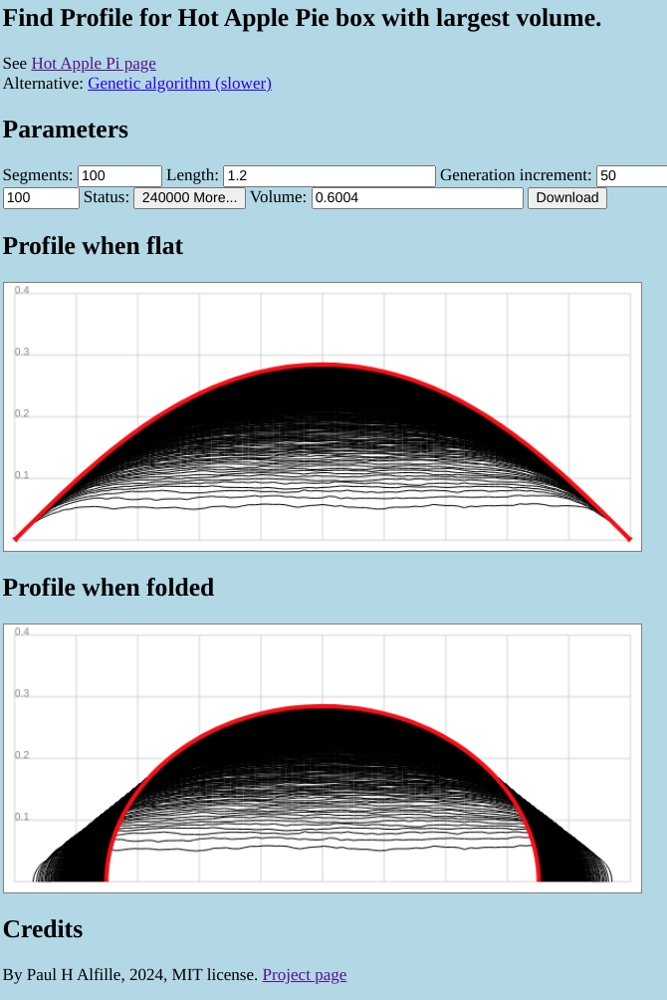

# Maximum - Approximation

We will investigate approximation methods in the [descrete case](./segments.md) for maximizing box volume.

 

### Goal

Maximize volume \\(V\\) where: 

\\[V=4\times\sum\_{i=1}\^{N}V\_i\\]

and each slice:

\\[V\_i={\frac{\lbrace 3 \hat{L} (u\_{i-1}+u\_i) -2 ( u\_{i}\^2+ u\_{i-1} u\_{i}+ u\_{i-1}\^2)\rbrace  \sqrt{1-N\^2 (u\_{i}-u\_{i-1})\^2}}{6 N}}\\]

### Parameters

* Length \\(\hat{L}\\) is the length ratio (to a width of \\(1\\\).
* Number of segments \\(N\\) -- although one extra is needed ([fencepost problem](https://en.wikipedia.org/wiki/Off-by-one_error)).

### Variables

The segment lengths:

\\[\lbrace u\_0,u\_1,u\_2,\ldots,u\_{N-1},u\_N\rbrace\\]

### Constraints

\\[u\_0=u\_N=0\\]
\\[0\leq u\_i\leq\hat{L}\quad\text{for all }i\\]
\\[\lvert u\_{i+1}-u\_i\rvert\leq\frac{1}{N}\quad\text{for all }i\\]
 
### Algorithm

1. Calculate volume \\(V(\lbrace u\_1,\ldots,u\_{N-1}\rbrace)\\)
2. Modify the set to \\(\lbrace \bar u\_1 ,\ldots,\bar u\_{N-1}\rbrace\\) within the constraints
3. Calculate new volume \\(\bar{V}\\)
4. Choose set with higher volume
4. Repeat from 1. until stable maximum

### Live demo

[Try it now](https://alfille.github.io/HotApplePi_Segments/)

### Method

Two methods are used:

* Gradient
  * Each segment is adjusted in turn.
  * Test current value, max, min and 2 random values within the allowed band
* Genetic
  * A population of test series is chosen
  * The best half are "mutated" (a random pertubation) and replace the worse half.
  * The population is paired and mated, taking a sequence of segments from each mate and tested
* For this problem, with a stable solution, the gradient method is far faster
 