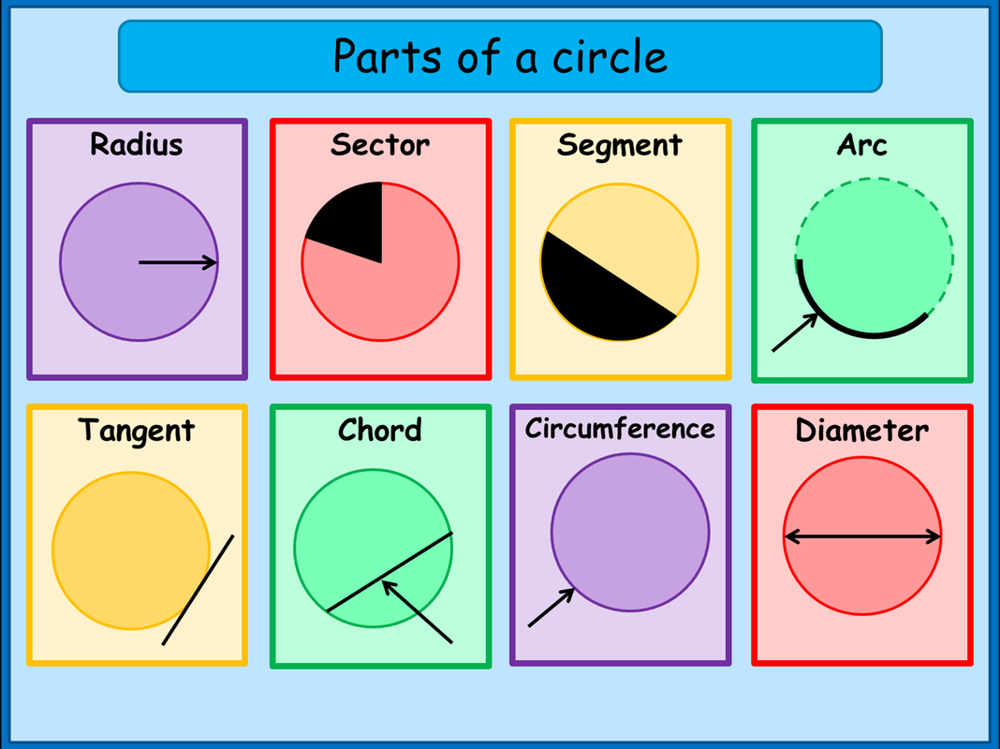

# Circular Arc Profile

If you look at the Hot Apple Pie box, it looks like a circular arc for the flap profile:

So how well does a circular arc work?

## Volcabulary

From [the internet](https:aplutopper.com)

## Setup

* Consider this *sector* with an angle \\(-{\theta}\_0\leq\theta\leq\{\theta}\_0\\)
* *Radius* \\(R\\)
* The unfolded dimension along the *chord* is
\\[s(\theta)=R \sin(\theta)\quad -R \sin({\theta}\_0)\leq s \leq R \sin({\theta}\_0)\\]
* Width is the length of the *chord*
\\[W=2 R \sin({\theta}\_0)\\]
* The curve is the *arc* 
\\[f(s(\theta))=R \cos(\theta) - R \cos({\theta}\_0)\\]
* Maximum curve height
\\[f\_{max}=R (1-\cos({\theta}\_0)\leq L\\]
* Curve *tangent* (derivative)
\\[f'(s)=\frac{\frac{d f}{d \theta}}{\frac{d s}{d \theta}}=- \tan(\theta)\\]
* Constraint that \\(\lvert f'\rvert \leq 1\\) implies
\\[0\leq{\theta}\_0\leq\pi/4\\]

## Normalize \\(W=1\\)

* *Radius*
\\[R=\frac{1}{2 \sin({\theta}\_0)}\\]
* *Chord* coordinate
\\[\hat{s}=\frac{\sin(\theta)}{2 \sin({\theta}\_0)}\quad -1/2\leq \hat{s} \leq 1/2\\]
\\[d \hat{s}=\frac{\cos(\theta)}{2 \sin({\theta}\_0)} d \theta\\]
* *Arc*
\\[\hat{f}(\hat{s})=\frac{\cos(\theta)}{2 \sin({\theta}\_0)}-\frac{\cos({\theta}\_0)}{2 \sin({\theta}\_0)}\\]
\\[\hat{f}'(\hat{s})=\frac{d \hat{f}}{d \hat{s}}=- \frac{\sin(\theta)}{\cos(\theta)}\\]

## Folded (normalized)

\\[d \hat{x}=\sqrt{1-\hat{f}'\^2} d \hat{s}= \frac{\sqrt{\cos\^2(\theta)-\sin\^2(\theta)}}{2 \sin({\theta}\_0)} d \theta\\]
\\[\hat{z}=\hat{f}(\hat{s})=\frac{\cos(\theta)}{2 \sin({\theta}\_0)}-\frac{\cos({\theta}\_0)}{2 \sin({\theta}\_0)}\\]
\\[\hat{y}=\hat{L}-\hat{f}(\hat{s})=\hat{L}-\frac{\cos(\theta)}{2 \sin({\theta}\_0)}+\frac{\cos({\theta}\_0)}{2 \sin({\theta}\_0)}\\]
\\[\hat{L}=\frac{L}{2 \sin({\theta}\_0)}\\]

## Volume

Our expression for Volume:

\\[V=4 \int \hat{f}\times(\hat{L}-\hat{f}) d \hat{x}\\]

Or using \\(\theta\\) parametrically and recognizing that there is symmetry in \\(\pm\theta\\):

\\[V=\frac{8}{2\^3 \sin\^3({\theta}\_0)} \int\_0\^{{\theta}\_0} \lbrace\cos(\theta)-\cos({\theta}\_0)\rbrace \lbrace 2 \sin({\theta}\_0) \hat{L}-\cos(\theta)+\cos({\theta}\_0)\rbrace\sqrt{\cos\^2(\theta)-\sin\^2(\theta)}\\,d \theta\\]

The integral can be evaluated numerically, but is not resolvable in elementary functions.

## Maxima

We can try to find conditions for maximum volume for arc profiles.

\\[V = \int\_0\^{{\theta}\_0} F(\theta,{\theta}\_0,\hat{L}) d \theta\quad \text{where}\\, F(\theta,{\theta}\_0,\hat{L})=\frac{\lbrace\cos(\theta)-\cos({\theta}\_0)\rbrace \lbrace 2 \sin({\theta}\_0)L-\cos(\theta)+\cos({\theta}\_0)\rbrace\sqrt{\cos\^2(\theta)-\sin\^2(\theta)}}{\sin\^3({\theta}\_0)}\\]

### Length

\\[\frac{\partial V}{\partial \hat{L}}=0=\int\_0\^{{\theta}\_0}\frac{\partial F(\theta,{\theta}\_0,\hat{L})}{\partial \hat{L}}\\,d \theta\\]
\\[\int\_0\^{{\theta}\_0}\frac{\cos(\theta)-\cos({\theta}\_0)}{sin\^2({\theta}\_0)}\sqrt{\cos\^2(\theta)-sin\^2(\theta)}\\,d \theta=0\\]
\\[\int\_0\^{{\theta}\_0}\lbrace\cos(\theta)-\cos({\theta}\_0)\rbrace\sqrt{\cos\^2(\theta)-sin\^2(\theta)}\\,d \theta=0\\]

In the range \\(0\leq\theta\leq\pi/4\\) both terms are positive, so the integral is never 0. Indeed:
\\[\lim\_{\hat{L}\rightarrow\infty} V=\infty\\]

### Angle \\({\theta}\_0\\)

\\[\frac{\partial V}{\partial {\theta}\_0}=0= F({\theta}\_0,{\theta}\_0,\hat{L})-\int\_0\^{{\theta}\_0} F(\theta,{\theta}\_0,\hat{L}) \\,d \theta\\]
The first term is from integral limit being the dependent on \\({\theta}\_0\\), but note:
\\[F({\theta}\_0,{\theta}\_0,\hat{L})=0\\]

\\[\int\_0\^{{\theta}\_0}\frac{\cos\^3({\theta}\_0)+2 \cos({\theta}\_0)-2 \cos(\theta)\lbrace 2  \cos\^2({\theta}\_0)+1\rbrace+3 \cos\^2(\theta) \cos({\theta}\_0)-2 \sin({\theta}\_0)L \lbrace 3 \cos(\theta) \cos({\theta}\_0)+2 \cos\^2({\theta}\_0)+1\rbrace}{\sin\^4({\theta}\_{0})}\sqrt{\cos\^2(\theta)-\sin\^2(\theta)}\\,d \theta=0 
\\]