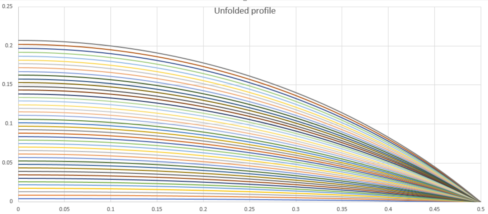
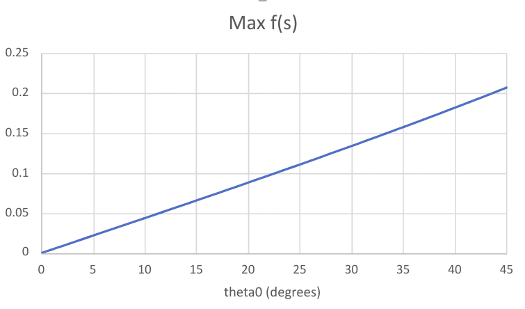
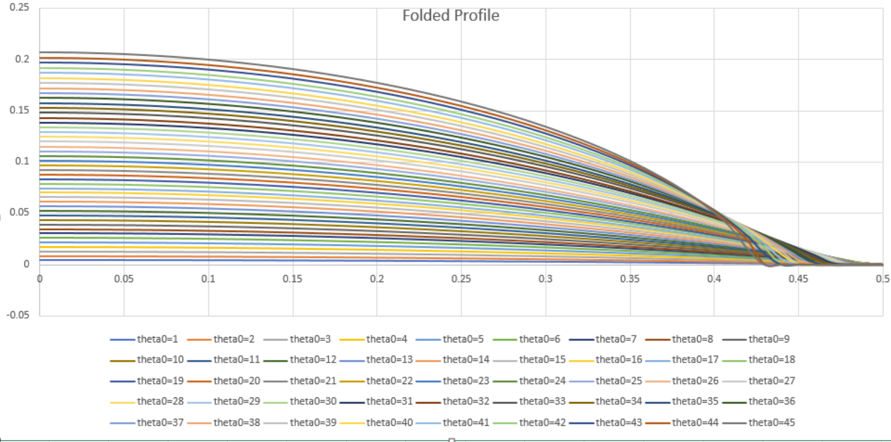
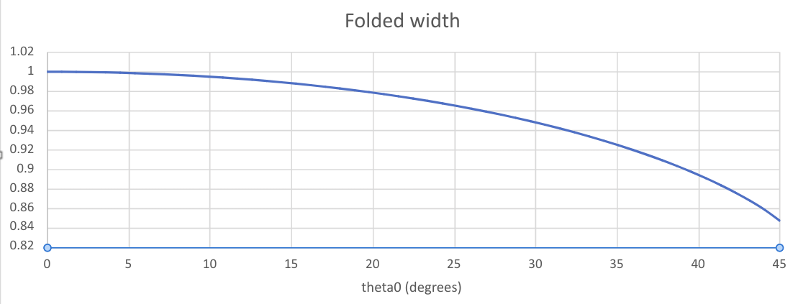
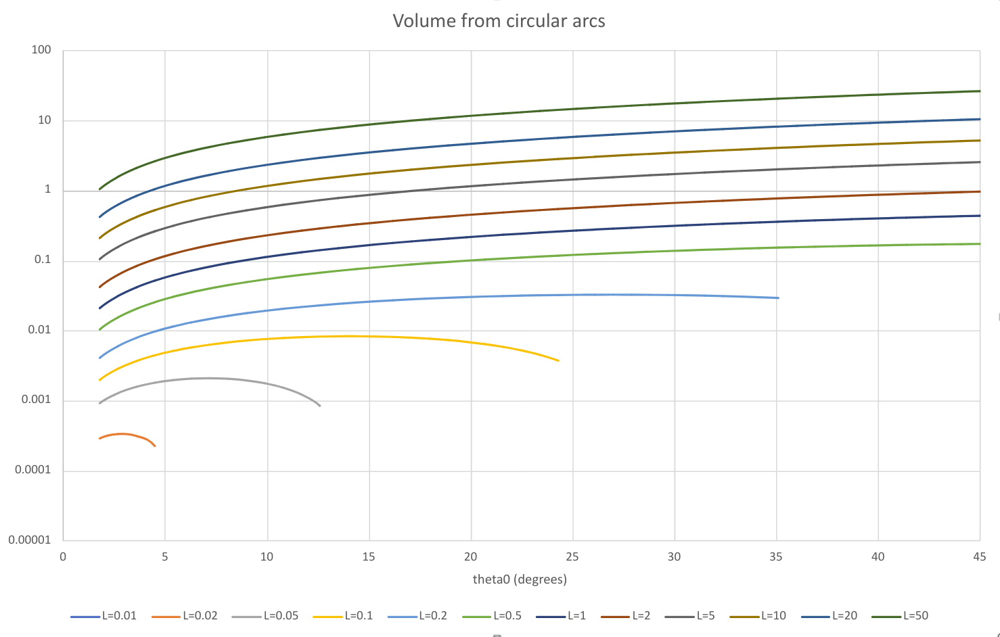
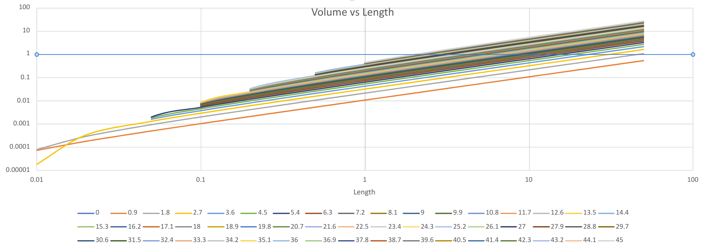

# Arc Numerical Results

## Natural Arcs

### Flat

These are the circular arcs, with angles \\({\theta}\_0\\) up to \\(45\^{\circ}\\)

Note that normalizing means that unfolded width is pinned at 1

This means that the maximum height is linear in \\({\theta}\_0\\)

### Folded

The folded profiles are subtly different, and the width is narrower for the larger arcs.

### Volume

Volume depends on both Length, and arc. For shorter lengths, only flatter arcs are permitted.

Another view is a separate curve for each \\({theta}\_0\\)
