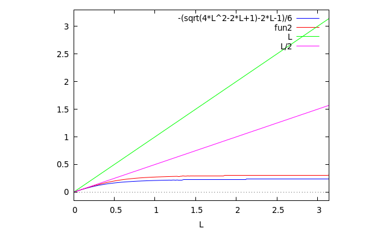

# Extremal -- Comparison

### \\(f(.5)=\max(f(s))\\) 

* __Blue__ Straight approximation
* __Red__  \\(\sin()\\) Approximation
* __Green__ Length \\(L\\)
* __Purple__ Limiting \\(L/2\\)

Straight and \\(\sin()\\) are very close in the \\(L<1\\) region.

### Volume

* __Blue__ Straight approximation
* __Red__  \\(\sin()\\) Approximation
* __Green__ [Long Length](./long.md) Assymptote

### Actual

Using the segment approach and gradient optimizer:

* __Blue dots__ Measured results
* __Red line__  Straight Approximation
  * not seen, under __Green__
* __Green line__ \\(\sin()\\) Approximation
* __Purple line__ Long length Assymptote

Remarkably good correlation!

* \\(L > 1\\) matches Long length
  * \\(\mathcal{O}(L\^1)\\)
  * Log/Log slope = 1
* \\(L < 1\\) matches both short length approaches
  * \\(\mathcal{O}(L\^2)\\)
  * Log/Log slope = 2
