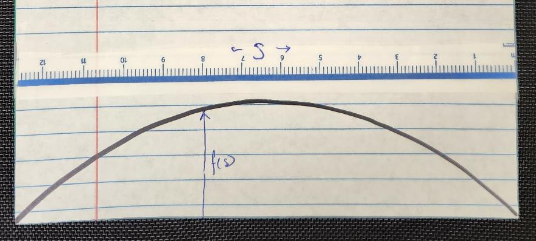
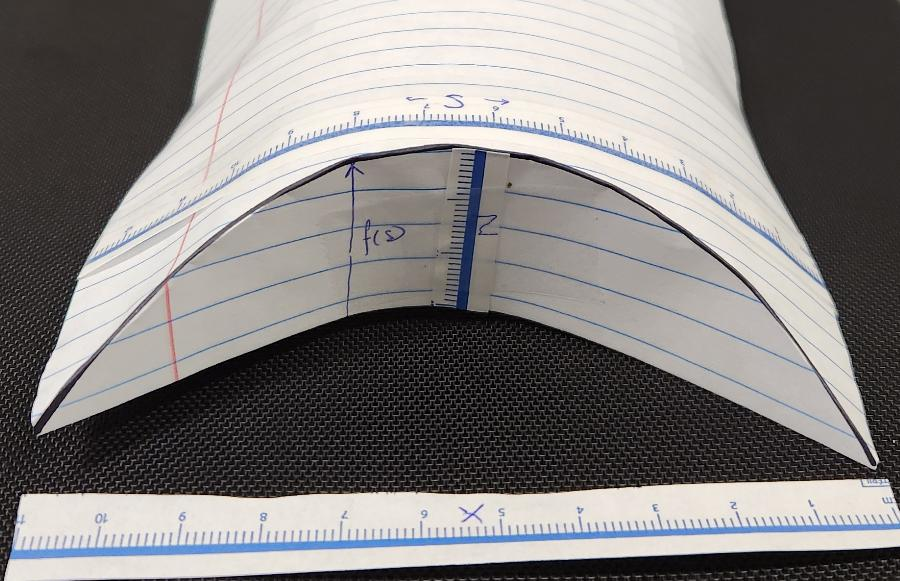

# Equation

The best approach to this problem is *parameterized*.

That means that we will use the distance along the flat box as our primary variable, even after folding the box!

## Flat

Call the distance  \\(s\\) and the length to the crease  \\(f(s)\\)

## Folded

Now 
* \\(s\\)  is measured along the curved surface 
* \\(x\\)  is the horizontal distance (which is not the same as  \\(s\\) )
* \\(z\\)  is the height of the curved surface
* \\(y\\)  is the remaining dimension extending back (along the curved surface)

## Parameter

We will find expressions for  \\(x, y, z\\)  in terms of  \\(s\\)

