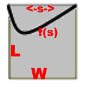

# Flat Equation

In [normalized](dimensions.md) format:

For the quarter section, before folding:

* Width = 1
* Length \\(\hat{L}\\)
* Horizontal variable \\(\hat{s}\\)
* Crease at \\(\hat{f}(\hat{s})\\)

Constraints:
\\[0 \leq \hat{s} \leq 1 \\]
\\[\hat{f}(0)=0, \quad \hat{f}(1)=0\\]
\\[0 \leq \hat{f}(\hat{s}) \leq \hat{L}\\]

Now we have to wrap that on the curved surface!

