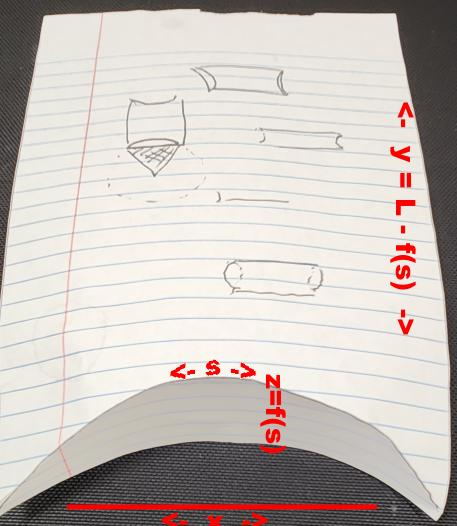

# Folded

## Coordinates

In folding the box:

* The length dimension (along *L*) becomes the *y* coordinate
* The width (*s* coordinate) now bends in the *x*/*z* plane

## Dimensions

Here is an example (simple) curve on a flat piece of paper. The *s* dimension is the width, and the curve is described as \\(f(s)\\)

Once folded, the new coordinates are shown

* *s* now follows the rule lines of the notepaper. It curves in the *x*/*z plane.
* The height of the surface in the *z* direction is \\(f(s)\\)
* the *x* dimension is compressed from *s* because of the curve

## Equations

\\[{d\hat{s}}\^2 = {d\hat{x}}\^2+{d\hat{z}}\^2\\]

Now on the surface, in parametric form:

\\[\hat{z}=\hat{f}(\hat{s})\\]
\\[\text{So}\quad d\hat{z}=\hat{f'}(\hat{s})\\,d\hat{s}\\]
\\[\text{Thus}\quad {d\hat{x}}\^2 = \lbrace 1 - {\hat{f'}(\hat{s})}\^2 \rbrace \\, {d\hat{s}}\^2\\]

Note that this adds a constraint:

\\[\lvert{f'(s)}\rvert < 1\quad\text{i.e.}\\,<45\^{\circ}\\]

And the length \\(y\\) of the surface (after folding down along *f(s)*:

\\[\hat{y}=\hat{L}-\hat{f}(\hat{s})\\]
\\[\text{So}\quad d\hat{y}=-\hat{f'}(\hat{s})\\,d\hat{s}\\]

## Edge solution

In theory, we've solved the equation for the surface of the folded box for arbitrary folding curve *f(s)*:

\\[\hat{x}=\int\_0\^{\hat{s}}\sqrt{1-{\hat{f'}(\sigma)}\^2}\\,d\sigma\\]
\\[\hat{y}=\hat{L}-\hat{f}(\hat{s})\\]
\\[\hat{z}=\hat{f}(\hat{s})\\]
