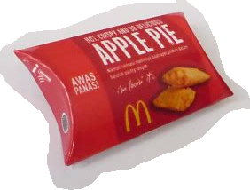
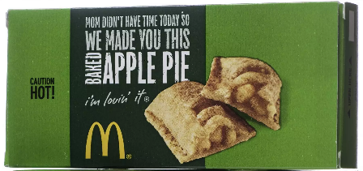

# Hot Apple Pi Project
## Introduction

This project is an exploration of the interesting packaging for MacDonald Restaurant Hot Apple Pi.

Actually these deserts are apparently no longer available, but shape of the box is still an interesting topic.

 As you can see, the shape is basically a cardboard tube, with creased crescents at each end that fold to overlap and create volume.
 

Unfortunately, not only are the pies now (arguably) less tasty, but the box is less interesting.

------

## Credits and License

* by Paul H Alfille, MD -- paul.alfille@gmail.com
* [MIT License](https://tlo.mit.edu/understand-ip/exploring-mit-open-source-license-comprehensive-guide#:~:text=The%20MIT%20License%20is%20known,retained%20in%20the%20redistributed%20software.)
* Site hosted on https://github.com/alfille/HotApplePi
* Images from Google Images -- possibly modified for size and background
  * Contact me if any images are not freely available
* Content server: [mdbook](https://rust-lang.github.io/mdBook/guide/installation.html)