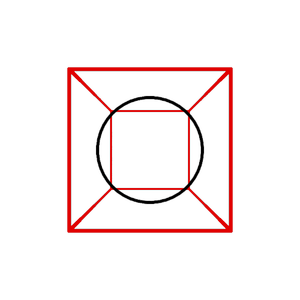

# Pinhole

[Pinhole-js](https://github.com/tidwall/pinhole-js/tree/master) is a pure Javascript program by Josh Baker that rotates a line drawing on the HTML Canvas.

It is apparently based on his Go program [Pinhole](https://github.com/tidwall/pinhole)

The code is MIT licensed, simple and reviewed (by me) for safety.

## Modifications

We use a [fork of Pinhole](https://github.com/alfille/pinhole-js) with the following modifications:

* Added tthtic's [ellipse](https://github.com/tthtlc/pinhole-js/tree/master)
* changed to Javascript classes (i.e. E6 syntax)
* removed most global "vars"
* Moved the rotating event loop out of the main code body
* Added control buttons
* Added Web worker function to offload computation and display. This splits the project into:
  * Front end for control and interaction
  * Back end for display and rotation

## Front end

This part performs:

* Launch web worker (back end).
* Send graphics construction
* manage controls (buttons)

The front end is [pinhole-front.js](https://github.com/alfille/HotApplePi/js/pinhole-front.js) and should be added as a script in the main html file. In exposes 4 interfaces:

* new Pinhole(canvas_id) 
* Pinhole.buttons(button_div_id)
* Pinhole.scale(scale_factor) for a global scale factor (for all subsequent entries)
* Pinhole.ops([oplist]) in format below 

## Back end

Uses an offscreen canvas sent by front-end to display and rotate image

Stores construction and rotation parametes

## Communication

Web-worker standard: PostMessage front->back
Communication is all one-way.

### Messages

Post from Front-end to web worker back-end:

* type:"new"
  * send offscreen canvas reference
* type:"ops"
  * value: \[element, element, ...\]
    * list elements are list pairs
    * \[command \[args\]\]
  * "center" \[\]
  * "colorize" \[ "red" \]
  * "drawCircle" \[ x y, z, radius \]
  * "drawCube" \[ x0, y0, z0, x1, y1, z1 \]
  * "drawDot" \[ x, y, z, radius \]
  * "drawEllipse" \[ x, y, z, rad	iusA, radiusB \]
  * "drawLine" \[ x0, y0, z0, x1, y1, z1 \]
  * "rotate" \[ x, y, z \] *(static rotation)*
  * "scale" \[ x, y, z \]
  * "translate" \[ x, y, z \]
* type: "scale"
  * value: global_scale_value
* type: "rotate"
  * value: \[ x, y, z \]
  * generated by buttons
* type: "stop"
  * no value
  * generated by button
