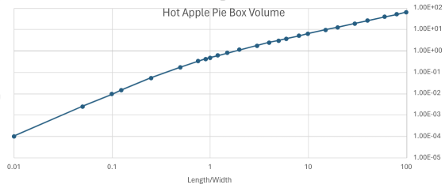

# Descrete approximation - results

This is the "normalized" volume for optimum solution given a length relative to width (unfolded).

Note that there is 2 regions:

* for \\(L/W < 1\\) the length of the tab is constrained by the length of the box.
* for \\(L/W > 1\\) the length of the tab is limited by the maximum slope (45 degrees).

Both regions are linear (for a log/log plot).

