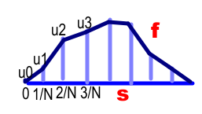

# Maximum - descrete case

 Find the maximum volume for a given length, using [line segments](./segments.md).
 

## Volume

We know that 

\\[V=4\times\sum\_{i=0}\^{N-1}V\_i\\]

where for each slice:

\\[V\_i={\frac{\lbrace 3 \hat{L} (u\_{i-1}+u\_i) -2 ( u\_{i}\^2+ u\_{i-1} u\_{i}+ u\_{i-1}\^2)\rbrace  \sqrt{1-N\^2 (u\_{i}-u\_{i-1})\^2}}{6 N}}\\]

Visually:

An optimum is found when:
\\[\frac{d V}{d u\_i}=0\quad\text{for}\\,i=1\rightarrow{N-1}\\]

Because each \\(u\_i\\) only appears in the two slices \\(V\_{i},V\_{i+1}\\)

this becomes a set of \\(N-1\\) equations:

\\[\frac{\partial V\_i}{\partial u\_i}+\frac{\partial V\_{i+1}}{\partial u\_i}=0\quad\text{for}\\,i=1\rightarrow{N-1}\\\]

