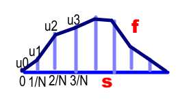

# Line Segments

Simple approach: Model \\(f(s)\\) as line segments.

Use a linear interpolation, where for each interval

\\[\hat{f\_i}=u\_{i-1},\quad\text{at}\quad\hat{s}=\frac{i-1}{N}\\]
\\[\hat{f\_i}=u\_{i},\quad\text{at}\quad\hat{s}=\frac{i}{N}\\]

So

\\[\hat{f\_i}=N (u\_i-u\_{i-1}) \hat{s} -(i-1)u\_i+i u\_{i-1}\\quad \text{for}\\,\frac{i-1}{N}\leq \hat{s} \leq \frac{i}{N}\\]

The endpoints are constrained

\\[u\_0 = u\_N = 0\\]

Calculate

\\[\frac{\partial \hat{f\_i}}{\partial \hat{s}}=\hat{f'\_i}=N (u\_i-u\_{i-1})\\]

For clarity let

\\[\Delta u\_i = u\_i - u\_{i-1}\\]

Then

\\[\hat{f\_i}=N \Delta u\_i \hat{s} -i \Delta u\_i+ u\_i\\quad \text{for}\\,\frac{i-1}{N}\leq \hat{s} \leq \frac{i}{N}\\]

and

\\[\hat{f'\_i}=N \Delta u\_i\\] 

Also, translating to the folded \\(x\\) dimention:

\\[\Delta x\_i = \sqrt{{\Delta s\_i}\^2-{\Delta u\_i}\^2} = \sqrt{\frac{1}{N\^2}-{\Delta u\_i}\^2}\\]

Unfortunately, the bare \\(u\_i\\) term in \\(\hat{f\_i}\\) makes the \\(\Delta\\) form less useful in the volume calculation.

## Volume

Using our [Volume](./volume.md) formula:

\\[Volume=4\times\int\_0\^1 \hat{f}(\sigma)\\,\lbrace\hat{L}-\hat{f}(\sigma)\rbrace\\,\sqrt{1-{\hat{f'}(\sigma)}\^2}\\,d\sigma\\]

Break into descrete slices:

\\[Volume=4\times\sum\_{i=1}\^N V\_i\\]

where

\\[V\_i=\int\_{\frac{i-1}{N}}\^{\frac{i}{N}} \hat{f\_i}(\sigma)\\,\lbrace\hat{L}-\hat{f\_i}(\sigma)\rbrace\\,\sqrt{1-{\hat{f'\_i}(\sigma)}\^2}\\,d\sigma\\] 

Since the segments are linear, the derivative is constant and can be pulled out of the integral: 

\\[Volume\_i=\sqrt{1-(N u\_i-N u\_{i-1})\^2}\\,\int\_{\frac{i-1}{N}}\^{\frac{i}{N}} \hat{f\_i}(\sigma)\\,\lbrace\hat{L}-\hat{f\_i}(\sigma)\rbrace\\,d\sigma\\]

Substituting \\(\hat{f\_i}=N\left(u_{i}-u_{i-1}\right)\sigma-\left(i-1\right)u_{i}+i u_{i-1}\\)

\\[Volume\_i=\sqrt{1-(N u\_i-N u\_{i-1})\^2}\\,\int\_{\frac{i-1}{N}}\^{\frac{i}{N}} \lbrace N (u\_i-u\_{i-1}) \sigma -(i-1)u\_i+i u\_{i-1}\rbrace \\,\lbrace -N (u\_i-u\_{i-1}) \sigma +\hat{L}+(i-1)u\_i-i u\_{i-1}\rbrace\\,d\sigma\\]

\\[V\_i=\lbrace {\frac{\lbrace 2 i\^3-6 i\^2+6 i-2\rbrace  u\_{i}\^2+\lbrace -4 u\_{i-1} i\^3+\lbrace 6 u\_{i-1}+3 L\rbrace  i\^2-6 \hat{L} i-2 u\_{i-1}+3 L\rbrace  u\_{i}+2 u\_{i-1}\^2 i\^3-3 L u\_{i-1} i\^2-2 u\_{i-1}\^2+3 \hat{L} u\_{i-1}}{6 N}}-{\frac{\lbrace 2 i\^3-6 i\^2+6 i\rbrace  u\_{i}\^2+\lbrace -4 u\_{i-1} i\^3+\lbrace 6 u\_{i-1}+3 \hat{L}\rbrace  i\^2-6 \hat{L} i\rbrace  u\_{i}+2 u\_{i-1}\^2 i\^3-3 \hat{L} u\_{i-1} i\^2}{6 N}}\rbrace  \sqrt{1-N\^2 \lbrace u\_{i}-u\_{i-1}\rbrace \^2}\\]

Simpplfying:

\\[V\_i={\frac{\lbrace 3 \hat{L} (u\_{i-1}+u\_i) -2 ( u\_{i}\^2+ u\_{i-1} u\_{i}+ u\_{i-1}\^2)\rbrace  \sqrt{1-N\^2 (u\_{i}-u\_{i-1})\^2}}{6 N}}\\]

A few points to notice:

* There is no dependence on \\(i\\) *per se* which makes sense -- only on the two bounding endpoints \\(u\_{i-1}\\,\text{and}\\,u\_i\\)
* The \\(sqrt()\\) term corresponds to the change in width from folding
  * Write as: \\(\sqrt{1-N\^2 (u\_i-u\_{i-1})\^2}\\)
  * Constraint that \\(\lvert u\_i-u\_{i-1} \rvert<\frac{1}{N}\\)
* The terms with \\(\hat{L}\\) are essentially: \\(width\times\hat{L}\times u\_{average}\\) 
  * Proportional to length and average height
  * The quadratic terms subtract the volume lost to bending and shortening
* \\(V\_i \geq 0\\) when \\(\hat{L} \geq u\_i,\\,u\_{i-1}\\)