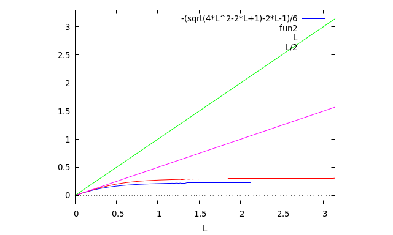
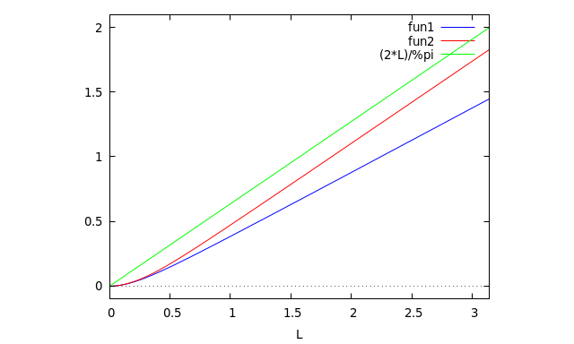
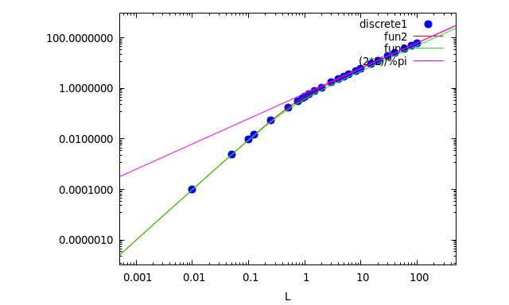

# Maximum Volume -- Short Length

By "short length" we mean \\(L\\) is small. Since \\(f \leq L/2\\) that means that \\(f\\) may still be of the same order as \\(L\\). In this case, \\(f\\) is limitted for much of its range by \\(L\\).

## Curve

Assume a flattened curve:

* endpoints:
\\[f(0)=0\quad f(1)=0 \\]

* center region:
\\[f(s)=f(.5)\quad s\_0 \leq s \leq 1-s\_0 \\]

What is less obvious is the end regions. We could use a polynomial approximation or a simpler sine approximation and simplest of all, a ramp.

### Center

\\[f(s)=f(.5)\\]
\\[f'=0\\]
\\[Volume\_{center}=4 f(.5) (L-f(.5)) (1-2 s\_0 )\\]

### Straight fit

Use a straight curve linking \\(f(0)=0\\) to \\(f(s\_0)=f(.5)\\) with \\(f'(s)=1\\) in this end region:

\\[f(s)=s\quad 0\leq s \leq s\_0 \\]

Note this implies \\(s\_0=f(.5)\\)

\\[f(s)=s\quad 0\leq s \leq f(.5)\\]
\\[f' = 1\\]

\\[Volume\_{end}=0\\]

\\[Volume = Volume\_{center}= 4 f(.5) (L-f(.5))(1-2 f(.5))\\] 

This has a maximum at

\\[f(.5)=\frac{2 L + 1 -\sqrt{4 L\^2-2 L +1}}{6}\\]

\\[Volume=\frac{2}{27}\lbrace{(4 L\^2-2 L + 1)}\^{3/2} - 8 L\^3 + 6 L\^2 + 3 L - 1\rbrace\\]

Taylor series:

\\[Volume=L\^2-L\^3+\frac{L\^4}{4}+\frac{L^5}{4}+\frac{L\^6}{8}+\cdots\\]

### \\(\sin()\\) fit

Fit a \\(\sin()\\) curve to the end region that satisfies the constraints.

\\[f(s)=f(.5) \sin(\frac{\pi}{2} \frac{s}{s\_0})\\]
\\[f'(s)=f(.5) \frac{\pi}{2 s\_0}\cos(\frac{\pi}{2} \frac{s}{s\_0})\\]

\\[f'(0)=f(.5) \frac{\pi}{2 s\_0} = 1\rightarrow f(.5)=\frac{2 s\_0}{\pi}\\]

So \\(f(.5)=\frac{2 s\_0}{\pi}\\) or \\(s\_0=\pi f(.5)/2\\)

\\[f(s)=f(.5) \sin(\frac{s}{f(.5)})\quad f'(s)=\cos(\frac{s}{f(.5)})\\]

For 8 ends:
\\[Volume\_{end}=8\times\int\_0\^{\pi f(.5)/2} f(.5) \sin\^2(\frac{s}{f(.5)})(L-f(.5) \sin(\frac{s}{f(.5)})) ds\\]
\\[Volume\_{end}=\frac{2 f(.5)\^2}{3} (3 \pi L - 8 f(.5))\\]

#### Maximize Volume

\\[Volume=Volume\_{end}+Volume\_{center}\\]
\\[Volume=\frac{2 f(.5)\^2}{3} (3 \pi L - 8 f(.5))+4 f(.5) (L-f(.5)) (1-\pi f(.5)
 )\\]

Solve for \\(f(.5)\\) giving maximum Volume:

\\[f(.5)=\frac{\pi L + 2 - \sqrt{\pi\^2 L\^2 + (16-8\pi) L + 4}}{8 \pi - 9}\\]

Which gives a total volume:

\\[Volume=\frac{{(\pi\^2 L\^2+(16-8\pi) L+4)}\^{3/2}-\pi\^3L\^3+12\pi\^2L\^2-24\pi L\^2+24\pi L-48L-8}{3 (9 \pi\^2-24\pi+16)}\\]

Taylor series

\\[Volume=L\^2-\frac{2}{3}L\^3+\frac{\pi\^2-8\pi+16}{16}L\^4+\cdots\\]

## Comparison

### \\(f(.5)\\)

* __Blue__ Straight approximation
* __Red__  \\(\sin()\)) Approximation
* __Green__ Length \\(L\\)
* __Purple__ Limiting \\(L/2\\)

Straight and \\(\sin()\\) are very close.

### Volume

* __Blue__ Straight approximation
* __Red__  \\(\sin()\\) Approximation
* __Green__ [Long Length](./long.md) Assymptote

### Actual

Using the segment approach and gradient optimizer:

* __Blue dots__ Measured results
* __Red line__  Straight Approximation
  * not seen, under __Green__
* __Green line__ \\(\sin()\\) Approximation
* __Purple line__ Long length Assymptote

Remarkably good correlation!

* \\(L > 1\\) matches Long length
* \\(L < 1\\) mathes both short length approaches
