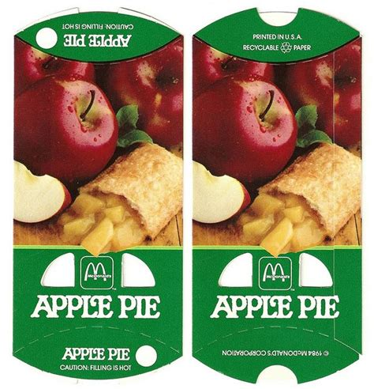

# Problem Statement

Make a container out of a flattened cardboard tube by folding over the specially shaped ends.

## Questions

* What is the exact shape of the box once folded?
  * Mathematically, do you go from unfolded to folded shape?
  * What are the constraints on the shape of the ends?

* What is the volume of the folded Hot Apple Pie box?
  * Is there an optimum shape to maximize volume?
  * How does the length of the box effect volume?
  * Is there any **&pi;** in the box?
  
For this we will need some analytic geometry, calculus, and calculus of variations.
 