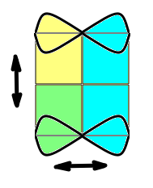

# Symmetry

### Mirror Symmetry

The flat box outline needs to match when folded down the centerline (**A**)

### End Tab Symmetry

The ends fold over to a matching crease as well

### Axial Symmetry

The two ends must match (**A**) so that the cross section is constant (**B**s).

### Simplified problem

Taking advantage of all the symmetries, we can analuze just the quarter panel in red.

### Parameters

From the quarter panel, it is clear that the only adjustable parameters are **L**ength, **W**idth, and curve **f**.

### Constraints

From physical requirements, it is clear that 

* **f** < **L**
* **f** touches the upper corners

We'll also later see that the slope of **f** has to be < 45 degrees, but that is less apparent from the diagram.

### Normalize

We can go one step further, and choose one of our dimensions as a reference size (1), and make the others a non-dimensional ratio.

### Symmetry in the curve

Typically the curve **f** will be symmetric (not as shown here). We won't require **f** symmetry in our analysis, though. 