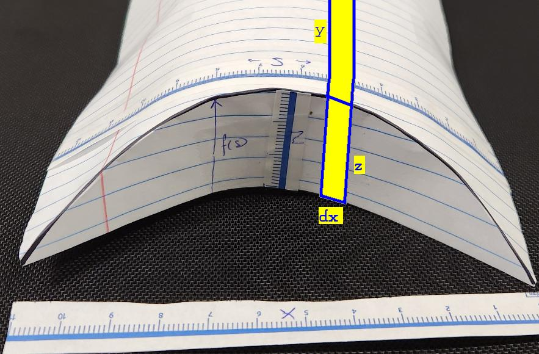

# Volume

What is the colume of the folded container?

## Folded

### Slice

We will (virtually) cut the box into long slices and add them up.

### Width (x-direction)

\\[d\hat{x}=\sqrt{1-{\hat{f'}(\hat{s})}\^2}\\,d\hat{s}\\]

### Height (z-direction)

(Full box is twice the height shown here)

\\[2\times\hat{f}(\hat{s})\\]

### Length (y-direction)

(Full box is twice the length shown here)

\\[2\times\lbrace\hat{L}-\hat{f}(\hat{s})\rbrace\\]

### Volume

Integrate \\(Height\times Length \times Width\\)

\\[Volume=4\times\int\_0\^1 \hat{f}(\sigma)\\,\lbrace\hat{L}-\hat{f}(\sigma)\rbrace\\,\sqrt{1-{\hat{f'}(\sigma)}\^2}\\,d\sigma\\]

This is the full solution for an arbitrary end profile of any length.

### Length dependence

What is the effect of the normalized length on the volume?

\\[Volume=4\times\hat{L}\times\int\_0\^1 \hat{f}(\sigma)\\,\sqrt{1-{\hat{f'}(\sigma)}\^2}\\,d\sigma-4\times\int\_0\^1 {\hat{f}(\sigma)}\^2\\,\sqrt{1-{\hat{f'}(\sigma)}\^2}\\,d\sigma\\]

Though from physical constraints

\\[\hat{L}\\geq\max{\hat{f}}\\]

### Un-normallized

Since we used *normalized* dimentions for height, width and length (i.e. divided each dimention by \\(W\\)):

\\[TrueVolume=W\^3\times Volume\\]

